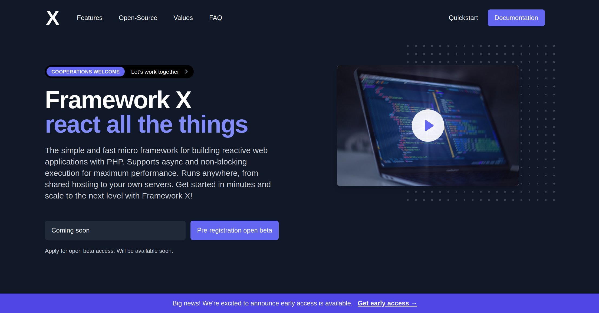

## How it works?

We ❤️ open-source! That's why we've published more than 100 projects on our GitHub ([**@clue**](https://github.com/clue)).

This GitHub page allows our sponsors to benefit from **exclusive early access** to our projects.
Each sponsor will receive an invitation by email and, once activated, will have full access to all our projects before they are made available to the general public.

In addition, each member of **clue·access** gets **exclusive access to our support channel**.

## Why clue·access?

Because we believe **open-source needs to be sustainable**.
You get the **best out of our projects** – we get sponsors to help us focus on **creating awesome projects**.
Win-win! 💪

We want you to have a chance to be involved in early project development stages.
You get the chance to access our projects before they are made available to the general public and provide early feedback.
We get the chance to collect feedback and know exactly what to focus on next.
Win-win again! 💪

Let's not forget the financial aspect of working on open-source full-time.
More sponsors mean we can spend more time on open-source.
[Sponsorware](https://github.com/sponsorware/docs) is (*you guessed it*) win-win! 💪

## Projects

* [**clue/reactphp-pq**](https://github.com/clue/reactphp-pq) –
  PQ ("peak"), automatically wrap blocking functions in an async child process and turn blocking functions into non-blocking promises,
  built on top of [ReactPHP](https://reactphp.org/).

* [**clue/reactphp-tsv**](https://github.com/clue/reactphp-tsv) –
  Streaming TSV (Tab-Separated Values) parser and encoder for [ReactPHP](https://reactphp.org/).

* [**clue/make.php**](https://github.com/clue/make.php) –
  A GNU Make clone written in pure PHP. Run your Makefiles no matter whether GNU make is available.

* [**clue/reactphp-s3**](https://github.com/clue/reactphp-s3) –
  Async S3 filesystem API (supporting Amazon S3, Ceph, MiniIO, DigitalOcean Spaces and others),
  built on top of [ReactPHP](https://reactphp.org/).

* [**clue/reactphp-clickhouse**](https://github.com/clue/reactphp-clickhouse) –
  Blazing fast access to your ClickHouse database, built on top of [ReactPHP](https://reactphp.org/).

* [**clue/reactphp-memoize**](https://github.com/clue/reactphp-memoize) –
  Automatically memoize async function calls by caching function results,
  built on top of [ReactPHP](https://reactphp.org/).

* **More to be announced** 🤫 –
  If you're impatient, follow us on Twitter.

## Published projects

Thanks to our sponsors we were able to publish the following projects.

* [**clue/framework-x**](https://github.com/clue/framework-x) –
  Framework X – the simple and fast micro framework for building reactive web applications that run anywhere.

  

## You want to be part of clue·access? Become a sponsor!

If you are interested in joining **clue·access** (tip: you should), then consider supporting our work. 
The easiest way to join would be to [**sponsor us on GitHub**](https://github.com/sponsors/clue) if you want us to continue creating even more awesome projects.

We invest a lot of time developing, maintaining and updating our awesome open-source projects. You can help us sustain this high-quality of our work by becoming a sponsor on GitHub. Sponsors receive other numerous benefits in return, details can be found on our [**sponsorship page**](https://github.com/sponsors/clue).

Let's take these great projects to the next level together.

## FAQ

**How do I access clue·access projects?** – 
*If your sponsorship is started, you will be invited to join clue·access on GitHub and become part of our sponsor team. This means that all the projects in clue·access are available to you.*

**How long does it take to get access?** –
*We first have to manually invite you via email, we strive to make this happen within an hour. If your sponsorship is started at our bedtime, it may take a little longer.*

**How long do I benefit from clue·access?** –
*You have access for as long as your sponsorship is active. If you cancel your sponsorship, you will
get access until the end of the payment period.*

**When do new projects get added to clue·access?** –
*We have endless projects in the pipeline, which will be progressively added to clue·access.*

**How long do projects remain part of clue·access?** –
*The projects remain until the final release. This is usually followed by a new project in clue·access.*

**Where can I learn more about clue·access?** –
*Find out more about us through [our blog](https://clue.engineering/2020/introducing-clue-access) or take a look at our [sponsoring page](https://github.com/sponsors/clue).*

## Feedback?

Send a tweet to [@another_clue](https://twitter.com/another_clue).

See you at **clue·access**.
*Cheers!* 🎉💥
